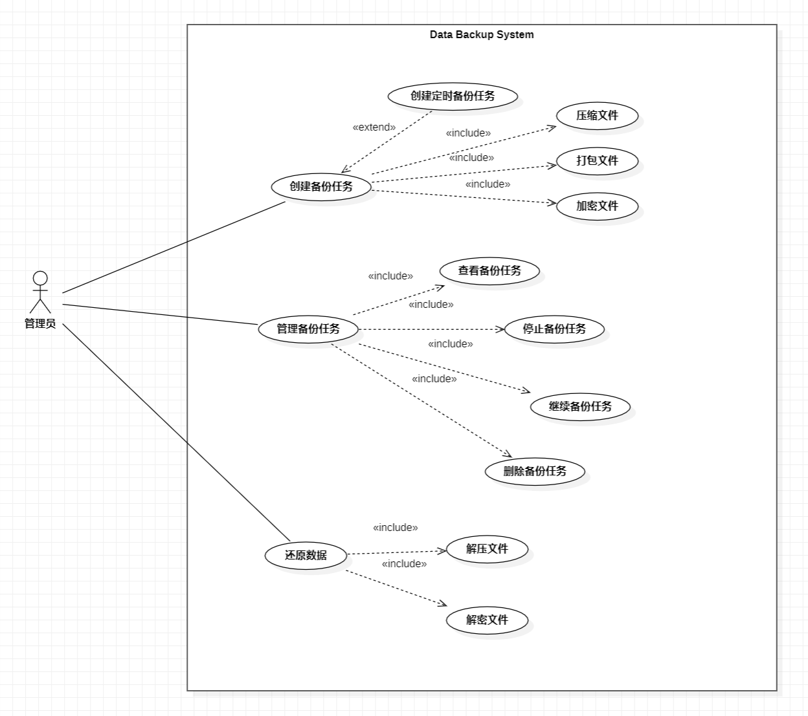

# 数据备份软件

软件开发综合实验-数据备份软件(filebak)

[Google开源项目编程规范](https://zh-google-styleguide.readthedocs.io/en/latest/)

## 实现功能

- 数据备份

- 数据还原

- 文件类型支持
  - 普通文件(r, regular)

  - 目录文件(d, directory)

  - 管道文件(f, FIFO)

  - 链接文件(s, symbolic link)

- 元数据支持

- 自定义备份
  - 路径

  - 类型

  - 名字

  - 时间

  - 定时

- 压缩解压

- 打包解包

- 加密备份

- 实时备份


## 开发环境

操作系统：Ubuntu22.04 LTS

开发语言：C++


## 使用方法

```
Usage:  filebak [OPTIONS] COMMAND

Options:
    -v, --version   版本信息
    -h, --help      帮助文档

Command:
    backup          备份数据或设置定时备份任务
    restore			恢复数据
    info            输出备份任务的信息
    stop            停止指定的备份任务
    start           继续指定的备份任务
    rm              删除指定的备份任务

Run 'filebak COMMAND --help' for more information on a command.
```

### backup

```
Usage:  filebak backup <source_path> [OPTIONS] [<args>]

设置备份任务

Options:
    # 元数据支持
    -m --metadata 保留元数据

    # 自定义备份
    --filter    记录规则的文本文件
    --path      正则表达式(仿照.gitignore)
    --name      正则表达式
    --type      普通文件(r, regular),目录文件(d, directory),
                管道文件(f, FIFO),链接文件(s, symbolic link)
    --time      "起始时间 终止时间"
                备份给定时间区间内的文件
    --task      "起始时间 终止时间 间隔"或"起始时间"

    # 打包解包
    始终打包，打包为.tar后缀

    # 解压压缩
    # -d --dcompress 	解压	解压xxxx.tar.cps文件
    -c --compress 	压缩	压缩为.cps后缀的文件，即xxxx.tar.cps

    # 加密解密
    -p --password 	加密密码

    # 实时备份
    --auto-backup	感知文件变化，自动进行备份
    
    -o --out		输出文件路径

    -m	--message	备份说明

    -v	--verbose 显示指令执行过程
```

### restore

```
Usage:  filebak restore <dir> <file> [[-p | --password] <args>]

从备份文件中恢复数据

dir		数据将恢复到该目录下
file	备份的数据文件
-p, --password	如果备份时设置了加密，则需输入密码解密 
```

> 当输入文件以`.tar.cps`结尾时，`restore`命令会自动解压该文件

### info

```
Usage:  filebak info [OPTIONS | task_id]

显示任务简要信息,或查看给定任务的详细信息

Options:
    -a	--all	    显示所有任务(默认)
    -s	--stop	    显示所有停止状态的任务
    -f	--finished	所有完成的任务
    -r	--running	正在运行的任务
```
简要信息输出格式

| Task ID | Status                | 加密   | 定时任务 | 目录 | Comment |
| :------ | --------------------- | ------ | -------- | ---- | ------- |
| 任务ID  | Stop/Finished/Running | Yes/No | Yes/No   |      |         |

详细信息输出格式：json

### stop

```
Usage:  filebak stop [task_id]

停止编号为task_id的备份任务
```

### start

```
Usage:  filebak start [task_id]

继续编号为task_id的备份任务
```

### rm

```
Usage:  filebak rm [task_id]

删除编号为task_id的备份任务
```


## 需求分析

### 用例图

管理员

- 创建备份任务
  - 定时任务（扩展）
  - 打包
  - 加密
  - 压缩

- 还原数据
  - 解密
  - 解压

- 管理备份任务
  - 查看
  - 停止
  - 继续
  - 删除




## 系统设计

非定时任务直接执行，输出执行结果

定时任务需要后台执行，记录执行日志

### 数据结构

| Name   | Description      |
| ------ | ---------------- |
| Task   | 备份任务         |
| Inode  | i节点            |
| Record | 打包文件中的记录 |


### 类

| Name        | Description                                                  |
| ----------- | ------------------------------------------------------------ |
| Filter      | 用户自定义的备份规则：文件路径、文件名、文件类型、时间区间等 |
| Packer      | 用于打包/解包文件                                            |
| Compressor  | 用于压缩/解压文件                                            |
| AES         | 加解密                                                       |
| Task        | 备份/还原任务                                                |
| TaskManager | 任务管理：新建、停止、继续、删除等                           |

#### 1. Filter

成员变量

```
rule_code	0001 0010 0100 1000
path_rule	文件路径规则
name_rule	文件名规则
file_type	文件类型
time_range	时间区间
```

成员函数

```
bool check()		判断文件是否满足用户自定义的规则
```

#### 2. Packer

打包、解包

#### 3. Compressor

Huffman编码压缩、解压

#### 4. AES

加密、解密(OpenSSL)

#### 5. Task

备份/还原任务

#### 6. TaskManager

任务管理


### 类图

>  访问属性
>
> `-`private
>
> `+`public
>
> `#`protected
>
> `~`package/default


### 顺序图


### 构件图
